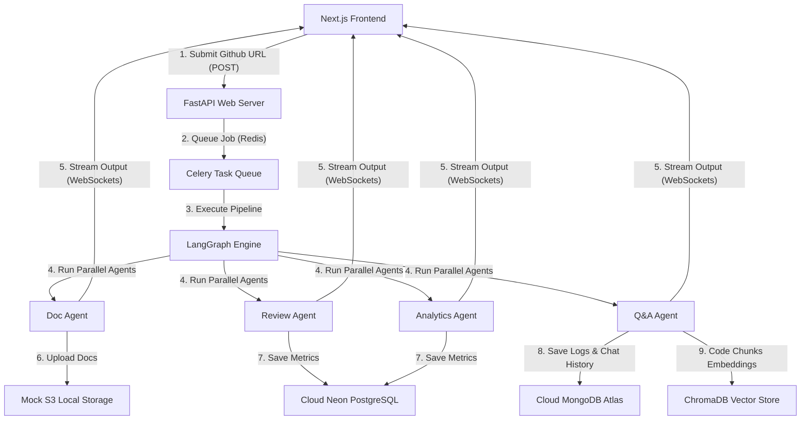

# System Architecture

## 1. High-Level Flow Chart


---

## 2. Directory Layout
We will organize the codebase following a modular pattern:
```
devmind/
├── backend/
│   ├── main.py                  # FastAPI app entrypoint
│   ├── api/
│   │   ├── routes/              # FastAPI endpoints (analyze, ws, results)
│   ├── agents/
│   │   ├── graph.py             # LangGraph state machine orchestrator
│   │   ├── doc_agent.py         # Parallel node: Doc Generator
│   │   ├── review_agent.py      # Parallel node: Code Reviewer
│   │   ├── qa_agent.py          # Parallel node: Q&A Engine
│   │   └── analytics_agent.py   # Parallel node: Complexity Analytics
│   ├── services/
│   │   ├── github_service.py    # Public repo fetcher
│   │   ├── embedding_service.py # Local sentence-transformers wrapper
│   │   ├── vector_store.py      # ChromaDB client
│   │   ├── storage_service.py   # Mock S3 file manager
│   │   └── celery_tasks.py      # Celery task runner
│   ├── models/
│   │   ├── pg_models.py         # SQLAlchemy schemas (Neon Postgres)
│   │   └── mongo_models.py      # MongoDB schemas (Atlas)
│   ├── core/
│   │   ├── config.py            # Pydantic environment configurations
│   │   └── database.py          # Postgres & MongoDB clients
│   └── tests/
│       ├── test_agents.py
│       └── test_api.py
├── frontend/
│   ├── app/
│   │   ├── layout.tsx
│   │   ├── page.tsx             # Homepage
│   │   ├── dashboard/[id]/      # Analysis panel (real-time stream)
│   │   └── components/          # Dashboard panels & charts (Vanilla CSS)
├── docker/
│   ├── Dockerfile.backend
│   ├── Dockerfile.frontend
│   └── docker-compose.yml
└── .gsd/
    ├── SPEC.md
    ├── ARCHITECTURE.md
    ├── ROADMAP.md
    ├── STATE.md
    ├── PLAN.md
    └── summaries/
```
