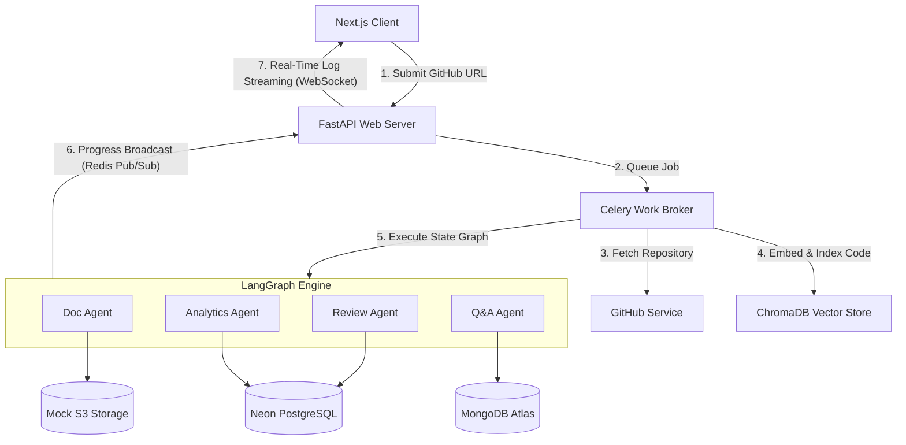

# DevMind AI Multi-Agent Platform

<div align="center">

[](LICENSE)
[](frontend/)
[](backend/)
[](backend/agents/)
[](docker/)

**DevMind** is a state-of-the-art, AI-powered Multi-Agent Code Intelligence Platform that analyzes public GitHub repositories in parallel. In minutes, it delivers comprehensive codebase documentation, identifies security/quality issues, provides a context-aware codebase Q&A chatbot, and charts complexity/size analytics.

</div>

---

## 🏗️ System Architecture

DevMind is designed with a distributed, non-blocking asynchronous architecture to ensure smooth scaling:



---

## ⚡ Core Features

- **GitHub Repository Fetcher:** Clones and parses public repositories, filtering out large binaries and media files.
- **AI Multi-Agent Pipeline:** Runs four specialized LangGraph nodes concurrently:
  - **Doc Agent:** Generates detailed Markdown files documenting the repository's modules and APIs.
  - **Review Agent:** Scans for code smells, bugs, and issues, grading them by severity.
  - **Q&A Agent:** Populates the ChromaDB index for RAG (Retrieval-Augmented Generation) interactive chat.
  - **Analytics Agent:** Extracts AST-based complexity scores, Lines of Code (LOC) weights, and class metrics.
- **Real-Time WebSocket Streaming:** Streams incremental status, agent thought process, and metrics directly to the browser.
- **Recharts Codebase Visualization:** Renders interactive scatter charts (Complexity vs. LOC), bar charts (Largest Files), and pie charts (File Tier Distribution).
- **Secure Authentication:** User signup and login utilizing JWT validation backed by a secure PostgreSQL user store.
- **Mock S3 File Storage:** Simulated AWS S3 storage wrapper on the local filesystem for document archiving.

---

## 🛠️ Technology Stack

| Component | Technology | Description |
|---|---|---|
| **Frontend** | `Next.js 16`, `TypeScript`, `Vanilla CSS` | Client dashboard & visual panels |
| **Backend** | `FastAPI (Python 3.11)`, `SQLAlchemy 2.0` | High-performance REST & WebSocket gateway |
| **Orchestration** | `LangGraph`, `LangChain` | State machine graph for parallel agent workflows |
| **Databases** | `PostgreSQL (Neon)`, `MongoDB (Atlas)` | Relational jobs/users & document Q&A log stores |
| **Broker/Cache** | `Redis (Upstash)` | Celery messaging broker & Pub/Sub channel |
| **Vector DB** | `ChromaDB` | Vector store for codebase chunk indexing |
| **Embeddings** | `sentence-transformers` | Local CPU-based code/text embedding vectors |

---

## 🚀 Getting Started

### 📦 1. Environment Configurations
Copy your environment template into a `.env` file at the root of the project. 

> [!CAUTION]
> Never commit or push the `.env` file! It contains sensitive database credentials and API tokens. The `.env` file is ignored in `.gitignore`.

```env
# Database Credentials
DATABASE_URL=postgresql+asyncpg://<user>:<password>@<host>/devmind?sslmode=require
MONGODB_URL=mongodb+srv://<user>:<password>@<cluster>.mongodb.net/devmind
REDIS_URL=rediss://default:<password>@<host>:<port>

# AI Keys
GROQ_API_KEY=gsk_...
HUGGINGFACE_API_KEY=hf_...

# Github Integration
GITHUB_TOKEN=ghp_...

# S3 Storage Configuration
AWS_S3_BUCKET=devmind-storage
JWT_SECRET=your_jwt_signing_key_here
```

### 🐳 2. Quickstart with Docker Compose (Recommended)
You can run the entire platform (Next.js client, FastAPI API, Celery worker) using Docker:

```bash
# Spin up all containers in detached mode
docker-compose up --build -d

# Verify containers are running
docker-compose ps
```
The Next.js client will be available at [http://localhost:3000](http://localhost:3000) and the FastAPI server at [http://localhost:8000](http://localhost:8000).

### 🔧 3. Running Manually (Development)

#### Backend API & Worker Setup:
```bash
# Navigate to backend and setup virtualenv
cd backend
python -m venv .venv
source .venv/bin/activate  # On Windows: .venv\Scripts\activate

# Install dependencies
pip install -r requirements.txt

# Start FastAPI server
uvicorn backend.main:app --reload --port 8000

# Start Celery Worker (in a separate terminal)
celery -A backend.services.celery_tasks.celery_app worker --loglevel=info
```

#### Frontend Client Setup:
```bash
# Navigate to frontend and install npm packages
cd frontend
npm install

# Run the next.js server
npm run dev
```

---

## 🧪 Running Tests

To verify the installation, you can execute the test suite:

```bash
# Run backend tests
pytest
```

---

## 📂 Subproject Documentation
For technical deep-dives into configuration, features, and setup, visit the subfolders:
- 📖 [Backend & Agent Pipeline Guide](backend/README.md)
- 🖥️ [Frontend Component & CSS Guide](frontend/README.md)
- 🐳 [Docker Deployment Configurations](docker/)