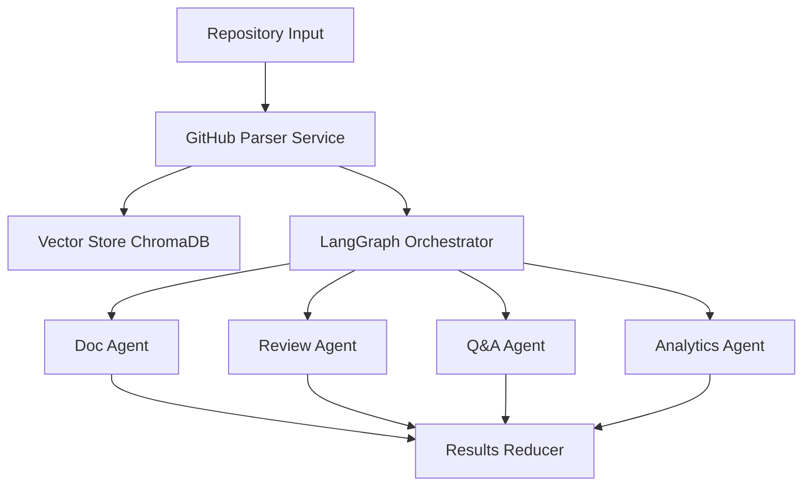

# DevMind AI Multi-Agent Platform - Backend API & Agent Pipeline

The backend of DevMind handles repository analysis using a state machine orchestrated by **LangGraph** and **LangChain**. It fetches repositories, runs parallel intelligence agents, processes code complexity analytics, and indexes files into a local vector store.

---

## 🏗️ Multi-Agent Architecture (Phase 2 Core)



### 🤖 Parallel Agent Nodes
1. **Doc Agent:** Auto-generates high-quality markdown READMEs and inline API structure summaries.
2. **Review Agent:** Scans code for anti-patterns, potential security bugs, and design flaws.
3. **Q&A Agent:** Prepares index mappings for interactive, context-aware RAG querying.
4. **Analytics Agent:** Extracts AST-based complexity scores, Lines of Code (LOC) distributions, and class/function density.

---

## 🛠️ Technology Stack & Engine
- **Orchestration:** LangGraph (State Graph) & LangChain
- **Embeddings:** Local CPU-based `sentence-transformers` (`all-MiniLM-L6-v2`)
- **Vector Store:** ChromaDB (Local SQLite-backed persistent client)
- **Programming Language:** Python 3.11+
- **Parsing:** Custom AST parsers (for Python and generic code analysis)

---

## 🚀 Running the Local Pipeline CLI
To test the core LangGraph multi-agent engine locally without the REST API:

```bash
# 1. Activate virtual environment
.venv\Scripts\activate

# 2. Run the test script on a public repository
python backend/scripts/run_pipeline_test.py --repo https://github.com/KennethReitz/envoy
```

---

## 🌐 FastAPI REST Server & Asynchronous Workers (Phase 3)

In Phase 3, we wrapped the multi-agent engine in a distributed REST API and WebSocket gateway:

### 🔌 API Endpoints
- `POST /api/analyze` - Submit a repository for analysis (returns a unique job UUID).
- `GET /api/results/{job_id}` - Retrieve the completed multi-agent analysis report.
- `WS /ws/{job_id}` - Establish a real-time WebSocket connection to stream individual agent progress logs and step outcomes.
- `GET/POST /api/results/{job_id}/qa` - Context-aware interactive Q&A session on the analyzed codebase.

### ⚙️ Celery & Redis Task Queue
To prevent blocking the HTTP server thread, analysis requests are offloaded to **Celery background workers**:
- **Message Broker:** Redis (using Upstash Redis for cloud environments).
- **Progress Tracking:** Workers publish step progress updates to Redis Pub/Sub, which is broadcasted to connected clients via WebSockets.

---

## 🧪 Unit & Integration Tests
We verify the agents, API, and WebSocket server using `pytest`:

```bash
# Run core pipeline tests
pytest backend/tests/test_github_service.py backend/tests/test_vector_store.py backend/tests/test_graph.py backend/tests/test_analytics.py

# Run REST API & WebSocket integration tests
pytest backend/tests/test_api.py backend/tests/test_ws.py
```
